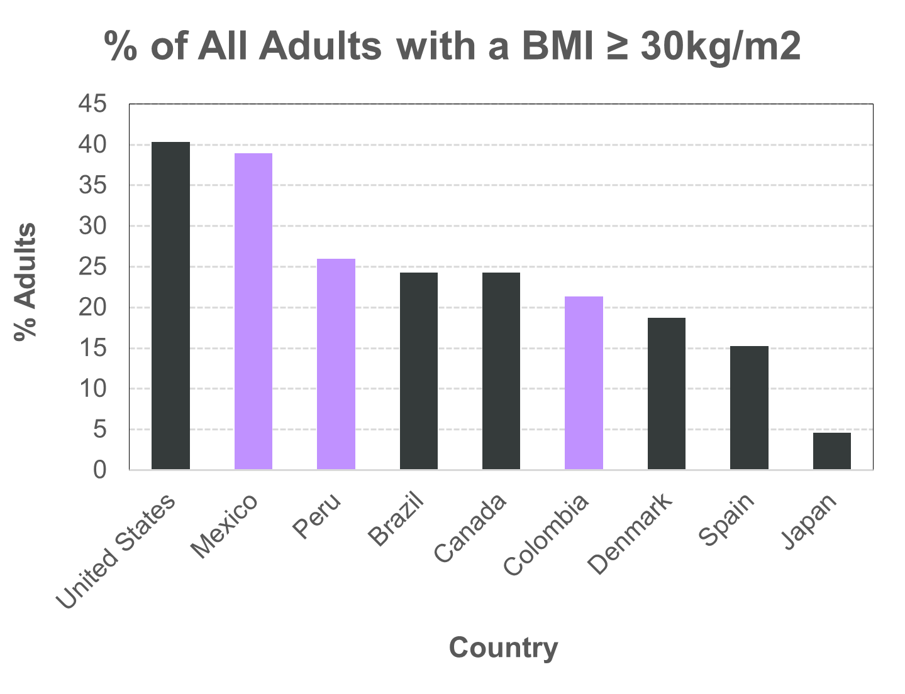

# **Classifying Obesity Levels Using Dietary and Lifestyle Information from Individuals in Colombia, Peru, and Mexico**

Data Science/ Machine Learning Software Foundations Certificate Program, Data Sciences Institute, University of Toronto

Cohort 6 - Team ML #6

This project focuses on an in-depth analysis of the “Estimation of Obesity Levels Based on Eating Habits and Physical Condition” dataset using Machine Learning models to determine which dietary and lifestyle attributes the most significant predictors of obesity levels. Our proposal outlines the development of the "Compass Proactive Health Platform" to identify individuals at risk of developing severe obesity, thereby enabling targeted preventative measures to reduce associated medical healthcare costs.

## **Contents**
* [Team Members](#team-members)
* [Introduction](#introduction)
* [Objectives](#objectives)
* [Methodology](#methodology)
* [Key Findings](#key-findings)
* [Conclusion](#conclusion)
* [Folder Structure](#folder-structure)
* [How to use this repo](#how-to-use-this-repo)
  
## **Main Contributors**

* Maria Rossano ([rossanot](https://github.com/rossanot))  
* Reshma Rajendran ([EzhavaReshma](https://github.com/EzhavaReshma))
* Ghazaleh Ahmadzadeh ([Ghazaleh-Ahmadzadeh](https://github.com/Ghazaleh-Ahmadzadeh))  
* Melanie Cheung See Kit ([melcsk](https://github.com/melcsk))
* Cristian Nicolas Cordova Puglianini ([NicoForce](https://github.com/NicoForce)) 

## **Introduction**
Obesity is a diagnosis given to individuals with excessive body fat and calculated Body Mass Index (BMI) of greater or equal to 30kg/m<sup>2</sup>. It often becomes a long-term and chronic health condition that is associated with increased risks of other complications, such as type 2 diabetes, heart disease, and cancer. Thus, patients’ treatments have become a heavy burden to the healthcare system. In the Americas region, obesity is a prevalent condition among adults (Fig. 1) and is estimated to cost 985.99 billion USD, mostly in medical expenses ([Okunogbe et al., 2022, e009773](https://pubmed.ncbi.nlm.nih.gov/36130777/)). 


<div align="center">
  
  <div style="text-align:justify; max-width:600px; margin:auto;">
    <b>Fig 1.</b> Percentage of Adults with obesity (BMI ≥ 30kg/m<sup>2</sup>) across selected countries (Data Tables | World Obesity Federation Global Obesity Observatory, 2025).
  </div>
</div><br />

In 2023, [a group of researchers ](https://www.nature.com/articles/s41586-023-06560-0) provided insights about genetic characteristics and environmental factors associated to certain traits determining the body mass index, glucose, and height of subpopulation groups within Mexico.

In this context, developing preventative measures to address obesity must be considered paramount. As a result, people’s quality of life would improve, thereby relieving the strain on the healthcare system, especially for countries where some form of universal health coverage is provided by the government. For example, in Colombia, about 19% of government spending was directed towards healthcare, representing approximately 6.6% of Colombia’s Gross Domestic Product (GDP) in 2021. ([Health in the Americas, Pan American Health Organization: Colombia Profile](https://hia.paho.org/en/country-profiles/colombia))

### **Business Motivation**
Here, we propose to determine the features that have the most meaningful impact on their obesity status. These factors range from an individual’s medical history, dietary and health habits to fitness activity. We aim to achieve this goal by training a machine learning model within the context of a classification problem. By identifying the dietary and lifestyle factors influencing obesity in individuals, healthcare providers could help improve tailored solutions for patients that could be translated into a higher treatment success rate. 

- **Client**: Goverment within a context of Business-to-Government (B2G) scheme
- **End User**: Health providers, e.g., hospitals and physicians

### **Dataset Details**
* Source: [UC Irvine Machine Learning Repository](https://archive.ics.uci.edu/dataset/544/estimation+of+obesity+levels+based+on+eating+habits+and+physical+condition) 
* Sample size: 2111
* Features: 16
* Target variable: Obesity level
* Target labels:
Insufficient Weight, Normal Weight, Overweight Level I, Overweight Level II, Obesity Type I, Obesity Type II, and Obesity Type III

**Table 1. Feature Description**
| Feature Name        | Type | Description |
| ----------------- | ------ | ----------------- |
| Gender      | Categorical      |               |
| Age     | Continuous      |               |
| Height     | Continuous      |               |
| Weight      | Continuous      |               |
| family_history_with_overweight      | Binary     | Has a family member suffered or suffers from being overweight?              |
| FAVC | Binary | Do you eat high caloric food frequently? |
| FCVC | Integer | Do you usually eat vegetables in your meals? |
| NCP | Continuous | How many main meals do you have daily? |
| CAEC | Categorical | Do you eat any food between meals? |
| SMOKE | Binary | Do you smoke? |
| CH2O | Continuous | How much water do you drink daily? |
| SCC | Binary | Do you monitor the calories you eat daily? |
| FAF | Continuous | How often do you have physical activity? |
| TUE | Integer | How much time do you use technological devices such as cell phone, videogames, television, computer and others? |
| CALC | Categorical | How often do you drink alcohol?|
| MTRANS | Categorical | Which transportation do you usually use? |

From exploratory data analysis, it was found that the target classes are not heavely imbalanced (see [Figure 2](#fig2)), as a result, no bias is expected from this component of the data.


<div align="center">
  
  <div style="text-align:justify; max-width:600px; margin:auto;">
    <b>Fig 2.</b> Distribution of classes of the target.
  </div>
</div><br />


The linear correlation between the various numerical features in the dataset was evaluated showing that no strong dependency between features existed (see [Figure 3](#fig3)). 

<div align="center">
  
  <div style="text-align:justify; max-width:600px; margin:auto;">
    <b>Fig 3.</b> Linear correlation between numerical features.
  </div>
</div><br />


> [!IMPORTANT]  
> **Dataset quality**
>
> As the authors discuss in the [original paper](https://pmc.ncbi.nlm.nih.gov/articles/PMC6710633/) where the dataset was first published, only 23% of the dataset corresponds to data collected from a group of participants of the research study via a web platform. The rest 77% of the datset was synthetically obtained using the [Synthetic Minority Over-sampling Technique (SMOTE)](https://www.jair.org/index.php/jair/article/view/10302) as implemented in the [Weka machine learning tool](https://weka.sourceforge.io/doc.packages/SMOTE/weka/filters/supervised/instance/SMOTE.htmlhttps://weka.sourceforge.io/doc.packages/SMOTE/weka/filters/supervised/instance/SMOTE.html). 
> 
> **SMOTE** effectively addresses the class imbalance problem by generating synthetic data within the minority class feature vector space. However, from construction, it **ineffectively handles categorical data** and it requires further tunning of the the nearest neighbours hyperparameter. Furthermore, SMOTE samples new examples by performing interpolations that constrain the generalization of the data.
>
> The obesity dataset used here has several categorical features and the authors do not specify the number of nearest neighbours they employed or whether or not such hyperparameter was optimized.
>
> **To improve the quality of the dataset and machine learning models we propose the following paths:**
>
> - Oversample minority class using GenAI methods based on Generative Adversaria Networks (GANs) or Variational Autoencoders, e.g., [ydata synthetic](https://github.com/ydataai/ydata-synthetic)
>
> - Information from other datasets could be integrated into the [dataset used here](https://archive.ics.uci.edu/dataset/544/estimation+of+obesity+levels+based+on+eating+habits+and+physical+condition) to cover demographics from regions other than Barranquilla, Colombia, Lima, Peru, and Mexico City, Mexico. For example, the one being created by [Moreno-Estrada A. an collaborators](https://www.nature.com/articles/s41586-023-06560-0).
>
> - Use algorithms and methods capable of effectively handling imbalanced datase such as those described at [imbalanced-learn](https://imbalanced-learn.org/stable/index.html).

## **Methodology**
Exploratory data analysis (EDA), data preprocessing and model training experiment outputs are stored in the `data` folder using the corresponding timestamp of the experiment execution time.

In all cases, Jupyter notebooks were used to test code before implementing it into the final pipeline. 

### About project management 
- The team held regular virtual stand ups to discuss the project objectives, planning, progress, and address any blockers. 
- A google docs document was employed to keep track of the project progress, references and other documentation, model experiments planning, team ideation/brain stormming, meetings agenda and outcomes

### About project versioning using Git/GitHub
- Team members open and merged at least one pull request (PR) 
- At least two team members were assigned to reviewing each PR
- The team member to open the PR was not necessarily the person to close it
- Branches were <ins>deleted</ins> after revision and merging were completed

### **a. Data extraction**
Raw data was directly obtained as a .csv file from the database [UC Irvine Machine Learning Repository](https://archive.ics.uci.edu/dataset/544/estimation+of+obesity+levels+based+on+eating+habits+and+physical+condition) and stored in the `data/raw` folder for preprocessing.

### **b. Exploratory data analysis (EDA)**
EDA was performed on the raw and preprocessed datasets. It consisted of gaining fundamental insights of the datatasets such as the number of examples (rows) and features (columns), the type of data, missing values, duplicate examples, outliers, feature value distribution.

For the above we employed measures of central tendency, as well as a series of histograms, bar plots, and correlation matrices.

The EDA pipeline outputs, a report in .txt format and plots in .png format, are stored in the [data/eda](./data/eda/) folder.

### **c. Data preprocessing**
The raw dataset was systematically preprocessed to prepare it for machine learning. The pipeline was designed to handle different feature types, prevent data leakage, and ensure the data was in an optimal format for our classification models.

1. Feature Engineering
To better capture the relationship between age and obesity, the numerical Age column was transformed into a categorical feature. We created four distinct age groups: 'Adolescent' (0-18), 'Young Adult' (18-35), 'Adult' (35-55), and 'Senior' (55+). This helps the model interpret age as distinct life stages rather than a continuous value.

2. Encoding of Categorical Variables
Categorical features were encoded based on their specific type to convert them into a machine-readable format:

Ordinal Features: For features with a clear, inherent order, such as CAEC (Consumption of food between meals) and CALC (Consumption of alcohol), a manual mapping was applied (e.g., 'no' -> 0, 'Sometimes' -> 1). This preserves the valuable ordinal relationship in the data.

Nominal Features: For features without any inherent order, one-hot encoding was used. This included columns like Gender and MTRANS (Transportation). This method creates new binary columns for each category, preventing the model from assuming a false ranking between them.

Target Variable: The target variable, NObeyesdad, was converted from text labels (e.g., 'Normal_Weight', 'Obesity_Type_I') into numerical labels (0, 1, 2, etc.) using scikit-learn's LabelEncoder.

3. Train-Test Split and Preventing Data Leakage
To ensure our model's performance is evaluated accurately on unseen data, the dataset was split into a training set (80%) and a testing set (20%). Crucially, this split was performed before applying feature scaling. This is a critical step to prevent data leakage, where information from the test set could inadvertently influence the training process.

4. Feature Scaling
The numerical features, including Age, Height, Weight, and the ordinally encoded columns, were normalized using scikit-learn's MinMaxScaler. This scaler transforms each feature to a given range, which we set to (1, 5). This ensures that all numerical features are on a consistent scale, which can improve the performance and convergence of many machine learning algorithms. The scaler was fitted only on the training data and then used to transform both the training and testing sets.

### **d. Model training**
Team members tried different models and tools, see Table 2. 

#### **Table 2.** Experiments model details
| **Team member** | **Maria** | **Melanie** | **Ghazaleh** | **Cristian** |
|---|---|---|---|---|
| **Algorithm** | Random Forest Classifier | Random Forest Classifier |     [LightGBM](https://lightgbm.readthedocs.io/en/stable/) Classifier |     XGBClassifier |
| **Best parameters** | `{'criterion':   'entropy', 'max_depth': 15, 'n_estimators': 68}` | `{'max_depth': 21,   'n_estimators': 450}` | `{'learning_rate':   0.05, 'max_depth': 7, 'n_estimators': 350, 'num_leaves': 20}` | `{'classifier__learning_rate': 0.05, 'classifier__max_depth': 5,   'classifier__n_estimators': 325, 'classifier__subsample': 1.0}` |
| **Hyperparameter optimization   method** | [Optuna](https://optuna.org/) | [GridSearchCV](https://scikit-learn.org/stable/modules/generated/sklearn.model_selection.GridSearchCV.html) | GridSearchCV | GridSearchCV |
| **CV** | Yes | Yes | Yes | Yes |
| **Other** | Feature selection using   `mutual_info_classif` |  |  |  |
| **Performance** | CV Accuracy: 0.947 | Train Accuracy: 0.953  | Train Accuracy: 1.0 | Train Accuracy: 0.972 |
|  | Test Accuracy: 0.950 | Test Accuracy: 0.939 | Test Accuracy: 0.969 | Test Accuracy: 0.967    |

### **e. Model validation**
For the final implementation, the best performing models from [Table 2](#table-2-experiments-model-details) were chosen, using Optuna for hyperparameter optimization, cross-validation, and feature selection. In addition, a baseline using a decision tree with default parameters was included. 

#### **Table 3.** Baseline Model Experimental Details
| **Algorithm** | [Random Forest Classifier](https://scikit-learn.org/stable/modules/ensemble.html#forest) | |
|---|---|---|
| **Dataset** | Baseline   | Scaled |
| **Train Accuracy** | 1.000 | 1.000 |
| **Test Accuracy** | 0.905 | 0.915 |

During model validation, [Support Vector Classifier](https://scikit-learn.org/stable/modules/generated/sklearn.svm.SVC.html) (SVC) and [Light Gradient-Boosting Machine (LightGBM) Classifier](https://lightgbm.readthedocs.io/en/stable/) were compared, using Optuna and cross-validation during hyperparameter optimization.

#### **Table 4.** Model Validation Experimental Details
| **Algorithm** | SVC | SVC | LightGBM | LightGBM |
|---|---|---|---|---|
| **Best parameters** | `{'svc__C': 4, 'svc__kernel': 'poly', 'svc__gamma': 'auto'}` | `{'select__k': 8, 'svc__C': 6, 'svc__kernel': 'poly', 'svc__gamma': 'scale'}` | | |
| **Other** | | feature selection `SelectKBest` 'Height', 'Weight', 'family_history_with_overweight', 'FAVC', 'FCVC', 'CAEC', 'CALC', 'Gender_Male') | | |
| **Train Accuracy** | 0.998 | 0.983 | | |
| **Test Accuracy** | 0.967 | 0.962 | | |

### **f. Feature analysis**


### **g. Dashboard for model showcase**

## **Key Findings**
### About the dataset:
- No outliers were found
- Most of the numerical features show a Gaussian distribution
- Target classes are 

### About model training


## **Conclusion**

## **Folder Structure**

```bash
.
├───data
│   ├───eda
│   ├───preprocessed
│   └───raw
├───docs
│   └───figures
├───experiments
│   ├───model-exp-team-member.py
│   └───README.md
├───eda
│   └───eda.py
├───models
├───notebooks
├───README.md
```

- **data**: Contains raw and processed datasets
  - **eda**: EDA pipeline outputs, including a report .txt file and plots
  - **preprocessed**: preprocessed datasets
  - **raw**: source raw data
- **docs**: figures and tool files
 - **figures**: documentation figures and plots
- **eda**: EDA pipeline
- **models**: Contains files for model training and testing, as well as the finalized model
- **notebooks**: pre-implemented pipelines
- **README.md**: This file

## **How to use this repo**
It is recommended to create a dedicated environment for this repo,

```bash
conda env create -f environment.yml
```

If not installed,

```bash
pip install -r requirements.txt
```

Each component of the pipeline, for example data processing and model training, can be run using the `run.sh` file found in the project main directory as shown below.

- EDA:

```bash
bash run.sh eda
```

- Data processing

```bash
bash run.sh preproc
```

- Model training
- Model validation
- Dashboard
